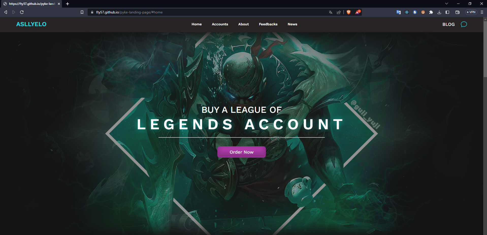
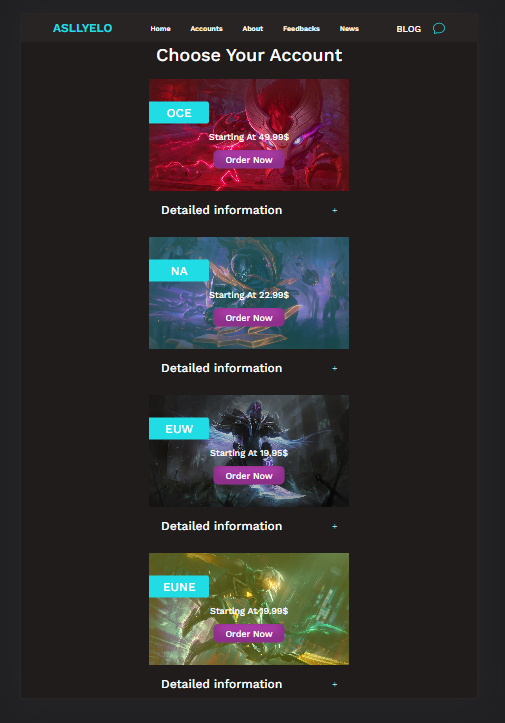
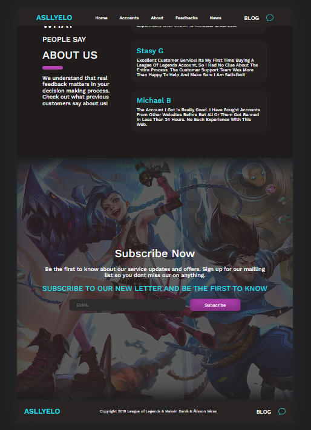

# Personal Project - Legends Account

This is a personal project for the construction of the website [League Account](https://fty57.github.io/pyke-landing-page/). Practice and dedication through challenges help you improve your coding skills and build realistic and better projects.

## Getting Started

First, run the development server:

```bash
npm run dev
# or
yarn dev
```

Open [http://localhost:3000](http://localhost:3000) with your browser to see the result.

You can start editing the page by modifying `pages/index.tsx`. The page auto-updates as you edit the file.

[API routes](https://nextjs.org/docs/api-routes/introduction) can be accessed on [http://localhost:3000/api/hello](http://localhost:3000/api/hello). This endpoint can be edited in `pages/api/hello.ts`.

The `pages/api` directory is mapped to `/api/*`. Files in this directory are treated as [API routes](https://nextjs.org/docs/api-routes/introduction) instead of React pages.

This project uses [`next/font`](https://nextjs.org/docs/basic-features/font-optimization) to automatically optimize and load Inter, a custom Google Font.

## Overview

### The challenge

Users should be able to:

- Navigate through the page and use the sticky menu button
- See the interactive elements that are inside the page
- Test your responsiveness on a mobile device

### Links

- Live Site URL: [Site](https://fty57.github.io/pyke-landing-page/)

### Screenshot




## References & Material Used
- [Site Reference](https://www.behance.net/gallery/87871159/League-Of-Legends-Landing-Page)
- [Art Pyke Used](https://www.behance.net/gallery/77784737/WALLPAPER-PYKE-LEAGUE-OF-LEGENDS)
- [Others Images](https://br.millenium.gg/)

## Author

- Github - [@fty57](https://github.com/fty57)

### What I learned

- I've learned that a project may never be ready before you deploy it, even if you're excited to put it out there and show everyone around. I did, but still needed adjustments. So it's always worth one last code review.
